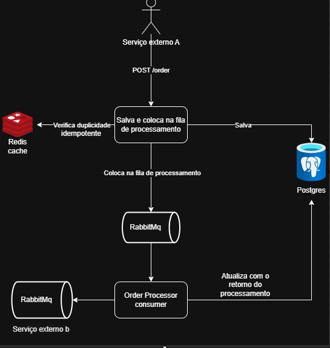

<h1 align="center">
  Order 
</h1>

<p align="center">
  
</p>

---

## Tecnologias

- **Java 21**
- **Spring Boot**
- **Banco de dados Postgres**
- **Cache com Redis**
- **RabbitMQ**
- **Swagger**
- **Design Pattern Strategy**
- **Design Pattern Factory Method**
- **Princípios SOLID**
- **Docker**
- **Idempotência**

---

## Como Executar

1. **Clonar o repositório**:
    ```bash
    git clone https://github.com/BrunoEstevam/order.git
    ```

2. **Subir as dependências do projeto** (Banco de dados, Redis e RabbitMQ) utilizando Docker Compose:
    ```bash
    docker compose -f 'docker-compose.yml' up -d --build
    ```

3. **Executar a aplicação Spring Boot**.

4. **Acessar a aplicação** em `http://localhost:8080/*`.

---

### Descrição das soluções

<h4> Banco de dados </h4>

O desafio consistia em desenvolver uma aplicação capaz de suportar até 200 mil pedidos por dia.

Foi considerado um volume de 400 mil pedidos diários, o que resultaria em um total de aproximadamente 4,63 transações por segundo (TPS). Com essa quantidade de transações, não há necessidade de utilizar um banco de dados não relacional.

Dessa forma, a escolha por um banco relacional foi preferida devido aos seguintes fatores:

<table border="1">
  <thead>
    <tr>
      <th>Benefício</th>
      <th>Descrição</th>
    </tr>
  </thead>
  <tbody>
    <tr>
      <td><strong>Estrutura de Dados Estruturada</strong></td>
      <td>Bancos relacionais organizam dados em tabelas com esquemas predefinidos, facilitando a estruturação e organização.</td>
    </tr>
    <tr>
      <td><strong>Integridade dos Dados</strong></td>
      <td>Garantem a integridade dos dados por meio de restrições, como chaves primárias e estrangeiras, e regras de normalização.</td>
    </tr>
    <tr>
      <td><strong>Suporte a Transações ACID</strong></td>
      <td>Garantem propriedades ACID (Atomicidade, Consistência, Isolamento e Durabilidade) para transações, garantindo alta confiabilidade.</td>
    </tr>
    <tr>
      <td><strong>Consultas Complexas</strong></td>
      <td>Oferecem suporte avançado para consultas complexas com SQL, incluindo junções (JOINs), agregações e subconsultas.</td>
    </tr>
    <tr>
      <td><strong>Segurança e Controle de Acesso</strong></td>
      <td>Possuem robustos mecanismos de controle de acesso e segurança, com suporte a permissões detalhadas para diferentes níveis de usuário.</td>
    </tr>
    <tr>
      <td><strong>Maturidade e Estabilidade</strong></td>
      <td>Bancos relacionais são amplamente utilizados, com décadas de desenvolvimento, garantindo uma plataforma confiável e estável.</td>
    </tr>
    <tr>
      <td><strong>Ferramentas e Suporte</strong></td>
      <td>Existem muitas ferramentas e recursos de suporte para bancos de dados relacionais, como backups, ferramentas de administração e otimização de consultas.</td>
    </tr>
  </tbody>
</table>

<h4> Comunicação </h4>

A aplicação foi projetada para receber dados de pedidos de duas formas: através de uma API REST ou via mensageria, permitindo uma arquitetura híbrida.

Para a comunicação com o serviço B, foi pensado em uma mensageria com RabbitMQ, proporcionando mais segurança para reprocessamentos e tolerância a falhas.

<h4> Demais pontos </h4>

Para resolver o problema de duplicidade de pedidos, foi aplicado o conceito de Idempotência e utilizado @Version para controle de concorrência

Para garantir a alta disponibilidade da aplicação, podemos optar por um serviço em cloud com auto scaling. Esse recurso permite que a aplicação se ajuste automaticamente à demanda, escalando os recursos para cima ou para baixo conforme necessário, garantindo desempenho ideal mesmo em picos de tráfego, e otimizando os custos durante períodos de baixa demanda.

O cache Redis foi pensado para compartilhamento entre diversas instâncias.

A aplicação adota o conceito de Strategy, onde a implementação da classe responsável pelo processamento do pedido é determinada de acordo com seu status. Isso significa que a lógica de processamento pode ser facilmente alterada ou estendida, permitindo adicionar novas etapas ou modificar as existentes no fluxo de processamento do pedido sem grandes impactos no código. Essa abordagem facilita a manutenção e a adaptação da aplicação para novas demandas ou requisitos futuros


## Order Endpoint

Este body pode ser utilizado tanto na API quanto na mensageria. A Idempotency-Key deve ser fornecida no header.

**URL**: `http://localhost:8080/order`

```http
HTTP/1.1 200 OK
Connection: keep-alive
Content-Type: application/json
Date: Tue, 05 Mar 2024 19:07:52 GMT
Keep-Alive: timeout=60
Transfer-Encoding: chunked
Idempotency-Key: colocar-alguma-string(exemplo: uuid)


{
  "idCustomer": 12213,
  "status": "cre",
  "items": [
    {
      "quantity": 1,
      "description": "string",
      "price": 1
    }
  ]
}
```
## Arquitetura




### Observações

- Certifique-se de ter o **Docker** instalado e configurado corretamente.
- O Swagger estará disponível para documentação da API em `http://localhost:8080/swagger-ui/index.html#/`.
